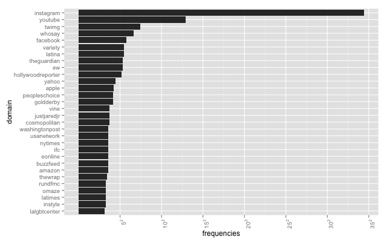

## Data Sources and Limitations

* Metadata - Golden Globe Nominees
    + 87 people nominees and 35 movie nominees
    + Manually collected/ annotated list of all nominees
        - Twitter Screen Names
        - Gender Flag
        - Film/ TV Show Flag
        - Age of Nominee/ Release Date

* Timelines
    + Based on most recent tweets since Dec 10 2015
    + Typically searched for top 3200 tweets from API
    + NLP processing performed e.g. removing stopwords etc

## Quick summary of metadata


## Key themes of our data exploration 

- **Pre-Post-During Golden Globe Analysis** - *Tomo*
- **Social Popularity of Winners and Nominees** - *Peter*
- **Sentiment Analysis** - *Boying*
- **Twitter Influence and Temporal Patterns** - *Jianglong*

## Jianglong Slide 1

```{r,echo=FALSE,message=FALSE,cache=TRUE}
source("./read_data.R")
source("./JH_function.R")
combined_timelines=JH_dataframe_addcolumn(combined_timelines)
agg.heatoc=JH_heatmap_df_generation(
  combined_timelines[as.logical(1-(combined_timelines$is.female+combined_timelines$is.male)),]
  )
agg.heat=JH_heatmap_df_generation(combined_timelines)
p3=JH_heatmap_plot(agg.heat)
p4=JH_heatmap_plot(agg.heatoc)
  grid.arrange(p3 + ggtitle("All Tweets Heatmap"),
               p4 + ggtitle("Official Accounts Tweets Heatmap"),
               nrow=2,
               top = textGrob("Heatmap For Tweet Density",
                              gp = gpar(fontsize=29)) 
)
```

## Jianglong Slide 2

```{r,echo=FALSE,message=FALSE,cache=TRUE}

agg.heatfe=JH_heatmap_df_generation(combined_timelines[combined_timelines$is.female,])
agg.heatma=JH_heatmap_df_generation(combined_timelines[combined_timelines$is.male,])
p1=JH_heatmap_plot(agg.heatfe)
p2=JH_heatmap_plot(agg.heatma)
grid.arrange(p1 + ggtitle("Female Tweets Heatmap"),
             p2 + ggtitle("Male Tweets Heatmap"),
             nrow=2,
             top = textGrob("Heatmap For Tweet Density",
                              gp = gpar(fontsize=29)) 
)

```

## Jianglong Slide 3

```{r,echo=FALSE,message=FALSE,cache=TRUE}
people=JH_tweet_power_df_generation(combined_timelines,nominees_metadata)
JH_tweet_power_scatter_plot(people)
```

## Jianglong Slide 4

```{r,echo=FALSE,message=FALSE,cache=TRUE}
JH_tweet_power_profile_plot(people)
```

## Peter Slide 1

```{r,echo=FALSE,message=FALSE,cache=TRUE}
knitr::read_chunk("similarity_plots.R")
knitr::read_chunk("follow_plots.R")
```

```{r setupSimilarity, echo = FALSE, cache = TRUE,warning=FALSE}
```

```{r similarityHist, echo = FALSE, cache = TRUE,warning=FALSE}
```

## Peter Slide 2
```{r similarityBar, echo = FALSE, cache = TRUE}
```

## Peter Slide 3
```{r followPlot, echo = FALSE, cache = TRUE}
```

## Peter Slide 4
```{r followProfiling, echo = FALSE, cache = TRUE}
```

## Boying Slide 1

```{r,echo=FALSE, message=FALSE, cache = TRUE}
source("./BG_plotting_functions.R")
ordered_retweet_count <- mentioned_dataframe(combined_timelines)
mentioned_retweet(ordered_retweet_count)
```

## Boying Slide 2

```{r,echo=FALSE,message=FALSE, cache = TRUE,warning=FALSE}
mention_plot(ordered_retweet_count, IS_PERSON = TRUE)
```

## Boying Slide 3



```{r,echo=FALSE,message=FALSE, cache = TRUE}

```

## Boying Slide 4

```{r kable,echo=FALSE,cache=TRUE}
male <- read.csv("../data/output_data/male.csv")
female <- read.csv("../data/output_data/female.csv")
library(knitr)
dt_gender_domain <- data.frame(Male = male$name[c(2, 4:6, 8:13)], 
                               PercentageM = male$freq[c(2, 4:6, 8:13)]*100,
                               Female = female$name[c(2:3, 5:12)], 
                               PercentageF = female$freq[c(2:3, 5:12)]*100)
kable(dt_gender_domain, digits=2)
```

## Tomofumi Slide 1

```{r,echo=FALSE,message=FALSE,warning=FALSE,cache=TRUE}
source('./pre_post_analysis.R')
source("./pre_post_function.R")
combined_timelines <- pre_post_modify(combined_timelines)
pre_post_plot("M", median_flag = FALSE)
```

## Tomofumi Slide 2

```{r,echo=FALSE,message=FALSE,warning=FALSE,cache=TRUE}
pre_post_plot("F", median_flag = FALSE)
```


## Conclusion and Next Steps

* Nominee Analysis shows distinct behaviour patterns
* Next Steps:
    + Do the analysis for Golden Globes 2015, 2014, 2013
    + Look at nominee influence via external data e.g. box office
    + Download large amount of historical follower analysis
    + Analysis of twitter users the nominees follow
